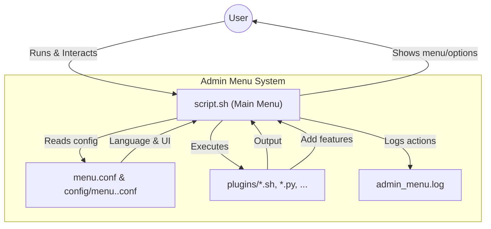

# 🚀 Admin Menu

[](https://www.gnu.org/software/bash/) [](LICENSE) 

A modern, extensible, **multilingual** Bash-based administrative menu for Linux servers. Features a plugin system, customizable configuration, colored interface, logging, Unicode/CJK support, and easy extensibility.

---

## 🌍 Multilingual & Internationalization
- **All user-facing messages are now in the `[MESSAGES]` section** of each language config file (English, Español, Deutsch, Français).
- **Easy to translate:** Copy any config, translate the `[MESSAGES]` section, and use `-l` to select it.
- **Menu navigation, help, and error messages are fully internationalized.**

---

## 🏗️ Project Architecture (Improved)



**How it works:**
- The user launches `script.sh`, which loads the main menu and configuration.
- Menu options are defined in `menu.conf` and language-specific files in `config/`.
- Each menu option is mapped to a plugin script in the `plugins/` directory.
- User actions and plugin results are logged to `admin_menu.log`.
- The system is fully extensible: add new plugins, configs, or languages as needed.

---

## ✨ Features
- 🖱️ **Interactive, paginated menu** with keyboard navigation
- 🌐 **Multilingual**: English, Spanish, German, French and more
- 🔌 **Plugin system**: add new features with simple scripts
- ⚙️ **Fully configurable** via config files (colors, messages, options)
- 🎨 **Colorful, visually consistent interface** (Unicode box drawing)
- 📝 **Logging** of all actions to `admin_menu.log`
- 🧩 **Easy to add, remove, or customize menu options**
- 🛑 **Graceful exit and interruption handling**
- 🧑‍💻 **Submenus and advanced navigation**
- 🏳️‍🌈 **Unicode, CJK, and emoji support**

---

## ⚡ Quickstart

```bash
# Clone your repository
 git clone https://github.com/stk/Admin_Menu.git
 cd Admin_Menu

# (Optional) Install Python wcwidth for best Unicode/CJK support
 pip install wcwidth

# Run the menu in English
 bash script.sh

# Run the menu in Spanish
 bash script.sh -l config/menu.es.conf

# Run the menu in German
 bash script.sh -l config/menu.de.conf

# Run the menu in French
 bash script.sh -l config/menu.fr.conf
```

---

## 💻 Multi-OS Support

Admin Menu is designed to work on:
- **Linux** (all major distributions)
- **macOS** (with Bash and coreutils)
- **Windows** (via WSL or Git Bash)

**Tips:**
- For best Unicode/emoji support, use a modern terminal (e.g., GNOME Terminal, iTerm2, Windows Terminal).
- On Windows, use [Windows Subsystem for Linux (WSL)](https://docs.microsoft.com/en-us/windows/wsl/) or [Git Bash](https://gitforwindows.org/).
- Some plugins may require adaptation for non-Linux systems (e.g., `ifconfig` vs `ip`, or `df` output).
- Python plugins require Python 3.

---

## 🖥️ Example Menu Output
**English:**
```
╭───────────────────────────────╮
│ ADMIN MENU                    │
│───────────────────────────────│
│ 1. Hello World                │
│ 2. Random Number              │
│ 3. Show Uptime                │
│ 4. List Home                  │
│ 5. Show Calendar              │
│ 6. Show IP                    │
│ 7. Check Internet             │
│ 8. Show Users                 │
│ 9. Show Memory                │
│10. Fortune                    │
│11. Hello from Python          │
│12. Exit                       │
╰───────────────────────────────╯
 12 options (1-12) | q Exit
Select an option and press Enter:
```

---

## 🎬 Demo ()

---

## 🔌 Plugin System & Structure
- **Plugins follow a clear naming convention:**
  ```ini
  [MENU]
  Hello World | 01_hello_world.sh
  Echo Example | 02_echo_example.sh
  ...
  ```
- **Logical submenus:**
  ```ini
  [MENU]
  BASICS | SUBMENU:BASICS
  LOGIC & STRINGS | SUBMENU:LOGIC
  SYSTEM & FILES | SUBMENU:SYSTEM
  ```
- **Submenu example:**
  ```ini
  [SUBMENU:BASICS]
  Hello World | 01_hello_world.sh
  Echo Example | 02_echo_example.sh
  ...
  Back to Main Menu | BACK
  ```
- **To add a new plugin:** Place your script in `plugins/`, make it executable, and add it to the appropriate section in your config.

---

## 📂 Submenus & Dynamic Titles
- **Submenus are grouped logically** (BASICS, LOGIC & STRINGS, SYSTEM & FILES).
- **Menu header dynamically shows the submenu path** (e.g., `ADMIN MENU  -->  BASICS`).
- **Non-selectable labels and uppercase titles** for clarity.

---

## 📝 Logging (Advanced)
- **Automatic log rotation** when `admin_menu.log` exceeds 1MB.
- **Session and user logging:** Each log entry includes session ID and username.
- **Log Tools submenu:**
  - Search logs by user or session
  - Export logs by date
  - View access/config changes

---

## 🛠️ Configuration: menu.conf & Multilingual Files (Updated Example)
All menu options, colors, messages, and plugins are configured in language-specific configs in `config/`.

**Sections:**
- `[APP]`: App name, version, description, author
- `[UI]`: Colors, border style, page size
- `[LOGGING]`: Log file and level
- `[PLUGINS]`: Plugin directory
- `[MENU_CONFIG]`: Main menu logic
- `[MENU]`: Menu options and their plugin mapping
- `[MESSAGES]`: All user-facing messages (required for full internationalization)

**Example `[MESSAGES]` section:**
```ini
[MESSAGES]
APP_NAME=ADMIN MENU
PROMPT_SELECT=Select an option and press Enter:
INFO_PAGE_OPTIONS=%s options | Page %s/%s %s | n/→ Next | p/← Prev | q Exit
ERROR_NO_INPUT=Error: No input provided.
EXIT_THANKS=Thank you for using %s!
... (other messages)
```

---

## 🧩 Tips & Troubleshooting (Updated)
- If the navigation bar or help messages do not appear in your language, ensure all messages are inside the `[MESSAGES]` section of your config file.
- For best Unicode/emoji alignment, use a modern terminal and install Python's `wcwidth` package.

---

## 📝 Example: Adding a New Language
1. Copy an existing config (e.g., `cp config/menu.en.conf config/menu.it.conf`).
2. Translate the `[MESSAGES]` section and menu items.
3. Run with `bash script.sh -l config/menu.it.conf`.

---

## 📝 Example: Log Tools Submenu
- Access log tools from the main menu to search, export, and audit logs interactively.

---

## 🎨 Customization: Colors, Emojis, and More
- **Colors**: Set in `[UI]` section of your config (e.g., `TITLE_COLOR=magenta`)
- **Add Emojis**: Spice up your menu!
  ```ini
  [MENU]
  🖐️ Say Hello|hello_world.sh
  🎲 Random Number|random_number.sh
  💾 Show Disk|show_disk.sh
  🚪 Exit|exit.sh
  ```
- **Messages**: All user-facing messages are in `[MESSAGES]` in your config
- **Languages**: Add new config files in `config/` for more languages

---

## 📝 Logging
All actions are logged to `admin_menu.log` with timestamps and status. Useful for auditing and troubleshooting.

---

## ➕ Adding a New Plugin
1. Create a script in `plugins/` (e.g., `my_plugin.sh`)
2. Make it executable: `chmod +x plugins/my_plugin.sh`
3. Add an entry in `[MENU]` in your config:
   ```
   My Plugin|my_plugin.sh
   ```

---

## 🛡️ Security & Best Practices
- Only add trusted scripts to the `plugins/` directory.
- Make sure plugins are executable (`chmod +x`).
- Review plugin code for security if using third-party scripts.
- Use logging to audit menu usage.
- Avoid running as root unless necessary.

---

## 🧑‍💻 Contributing
Contributions are welcome! You can:
- Add new plugins (Bash, Python, etc.)
- Translate the menu to new languages (add a config file in `config/`)
- Improve documentation or add examples
- Report issues or suggest features

**How to contribute:**
1. Fork the repo
2. Create a branch (`feature/my-feature`)
3. Commit your changes
4. Open a Pull Request
5. For translations, add your config and update the README if possible!

---

## 🧩 Tips & Troubleshooting
- If you see "command not found" errors, make sure your plugin scripts are executable (`chmod +x`).
- For best visuals, use a terminal that supports Unicode and ANSI colors.
- You can add your own ASCII art or emojis to menu messages for more fun!
- If you want to reset logs, just delete `admin_menu.log`.
- If a language config is missing, the menu will fall back to English.
- For CJK/Unicode alignment, ensure you have Python 3 and the `wcwidth` package installed (`pip install wcwidth`).
- **Permission denied?** Run `chmod +x script.sh plugins/*`.
- **Unicode not aligned?** Make sure your terminal and font support CJK/emoji.

---

## 🙏 Credits & Acknowledgments
- Inspired by open-source Bash menu projects and the Linux community
- Thanks to all contributors, translators, and testers
- Unicode/CJK width handling via [`wcwidth`](https://pypi.org/project/wcwidth/)

---

## 🖼️ Screenshots
- Menu: `images/loop_menu.png`
- Command Example 1: `images/command_1.png`
- Command Example 2: `images/command_2.png`
- Task Started: `images/task_started.png`
- Task Ended: `images/task_ended.png`

---

## ❓ FAQ
**Q: Can I use Python or other languages for plugins?**  
A: Yes! Any executable script works (Bash, Python, etc.).

**Q: How do I change the menu colors?**  
A: Edit the `[UI]` section in your config file.

**Q: What if a plugin fails?**  
A: The menu will show an error and log the event in `admin_menu.log`.

**Q: Can I have submenus?**  
A: Yes! You can extend the system to support submenus by adding more sections in your config and referencing them in the main menu.

**Q: How do I add a new language?**  
A: Copy an existing config, translate it, and use `-l` to select it.

---

## 📄 License
MIT License. See [LICENSE](LICENSE) for details.

---

## 🚀 Advanced Usage
- **Run with custom config:**
  ```bash
  bash script.sh -l config/menu.de.conf
  ```
- **Log output to a file:**
  ```bash
  bash script.sh | tee session.log
  ```
- **Automate menu startup on login:** Add to `.bash_profile` or `.bashrc`:
  ```bash
  [ -f ~/GIT/Admin_Menu/script.sh ] && bash ~/GIT/Admin_Menu/script.sh
  ```

---

## 🤖 CI/CD & Automation
- **Test plugins with shellcheck:**
  ```bash
  shellcheck plugins/*.sh
  ```
- **Automated tests:** Use `pytest` for Python plugins and custom scripts for Bash plugins.
- **Integrate with GitHub Actions:**
  - Lint scripts, check config syntax, and run basic menu tests on every push.
- **Sample GitHub Actions workflow:**
  ```yaml
  name: Admin Menu CI
  on: [push, pull_request]
  jobs:
    test:
      runs-on: ubuntu-latest
      steps:
        - uses: actions/checkout@v2
        - name: Lint Bash scripts
          run: shellcheck plugins/*.sh script.sh
        - name: Test Python plugins
          run: pytest plugins/*.py || true
  ```

---

## 🌍 Real-World Use Cases
- **Server onboarding:** Provide a friendly menu for new sysadmins.
- **Kiosk/terminal mode:** Lock down a server to a safe, menu-driven interface.
- **Education:** Teach Bash scripting and plugin development interactively.
- **DevOps:** Use as a jumpbox menu for common admin tasks.
- **Cloud VMs:** Preinstall and use as a self-service admin panel.

---

## 🧰 Plugin Gallery (Extended)
- **System Info:** `show_uptime.sh`, `show_mem.sh`, `show_disk.sh`, `show_ip.sh`
- **User Management:** `show_users.sh`, `list_home.sh`
- **Fun & Utilities:** `fortune.sh`, `random_number.sh`, `hello_python.py`, `show_calendar.sh`, `check_internet.sh`
- **Custom Plugins:**
  - `backup_home.sh`: Backup user home directories
  - `update_system.sh`: Run system updates
  - `monitor_services.sh`: Check status of critical services
  - `weather.sh`: Show weather info (uses `curl`)

---

## 🛠️ Admin & DevOps Best Practices
- **Ansible:** Use roles for modular config, validate playbooks with `ansible-lint`, and manage secrets with Ansible Vault.
- **Kubernetes:** Deploy menu as a pod with persistent storage for logs, use ConfigMaps for menu configs, and monitor with Prometheus.
- **Security:**
  - Run plugins with least privilege.
  - Use SSH keys for remote access.
  - Regularly audit plugin scripts.
- **Backups:** Schedule regular backups of `admin_menu.log` and configs.

---

## 🗺️ Project Roadmap
- [ ] Web-based menu frontend (with REST API)
- [ ] Plugin marketplace/discovery
- [ ] User authentication and role-based access
- [ ] Plugin dependency management
- [ ] Enhanced logging and analytics dashboard
- [ ] Mobile-friendly TUI
- [ ] Docker image for easy deployment
- [ ] Integration with cloud providers (Azure, AWS, GCP)

---

## 🆘 Community & Support
- **Issues:** [GitHub Issues](https://github.com/<your-username>/Admin_Menu/issues)
- **Discussions:** Join the community forum (coming soon!)
- **Contributions:** See the [Contributing](#contributing) section above.
- **Contact:** Open an issue or pull request for help or suggestions.

---

## ❓ FAQ (Extended)
**Q: Can I run this on macOS or WSL?**  
A: Yes! The menu works on any Bash-compatible environment. Some plugins may need adaptation.

**Q: How do I add a plugin in another language (e.g., Go, Ruby)?**  
A: As long as the script is executable and outputs to stdout, it will work. Just add it to the plugins directory and menu config.

**Q: How do I reset the menu to defaults?**  
A: Restore the original `menu.conf` and language configs from your version control or backup.

**Q: Can I use this in a Docker container?**  
A: Yes! Add a `Dockerfile` that copies the project and sets the entrypoint to `script.sh`.

**Q: How do I add automated tests for my plugins?**  
A: Use `shellcheck` for Bash, `pytest` for Python, and add test scripts in a `tests/` directory.

---
